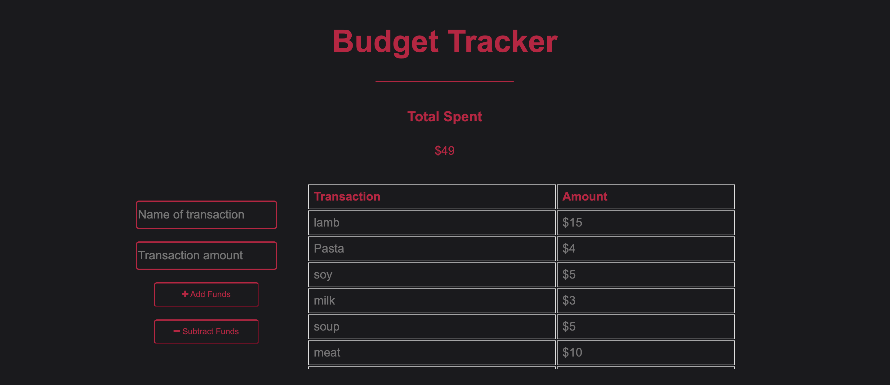

 https://opensource.org/licenses/MIT
  
  # Budget Tracker

  ## Deployed Site URL
  https://budgettracker-130721.herokuapp.com/
  
  ## Description
  This is a budget tracking application that allows a user to add and subtract expenses from a running total of expenses. The main purpose for the develpment of this application was to explore PWA websites and create an application capable of operating offline as well as online. The application is also downloadable, allowing users to install the site on their desktop of phone. The application is built with mongoDB, Mongo Atlas, express and compression.
  
  ## Table of contents:
  - [Installation](#installation)
  - [Usage](#usage)
  - [Contribution](#contribution)
  - [Test](#test)
  - [License](#license)
  - [Questions](#questions)

  ## Installation
  In order to run locally, mongoDB will need to be installed and running. For everything else, simply use the command 'npm i' to install.

  ## Usage
  Free usage

  ## Contribution
  If you have something you would like to contribute, feel free to reach out to me.

  ## Test
  n/a

  ## Images
  
  

  ## Questions
  Github: https://github.com/SamuelHeal
  Email: samuelheal@hotmail.com
  
